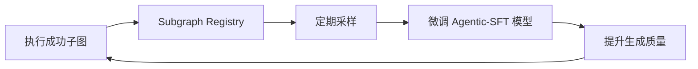
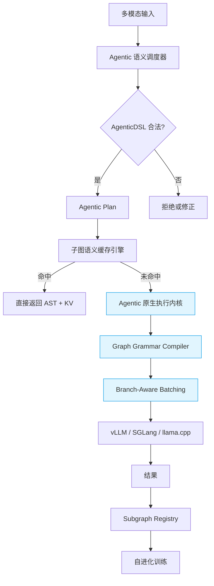

NexusInfer 的设计文档展现了强大的工程视野和前瞻性，其融合 **多模态输入、结构化输出、Agent 规划、Radix/vLLM 高性能机制** 的思路，与 AgenticLLM 的演进方向高度一致。

然而，**NexusInfer 当前设计仍停留在“通用推理框架 + Agent 支持”的层面**，而 **AgenticLLM 的核心思想是“行为即服务（Behavior-as-a-Service）”**——即：**推理引擎本身必须原生理解并保障智能体行为的语义正确性、资源边界与可终止性**。

下面，我将以 **AgenticDSL 与融合式 AgenticLLM 架构专家** 的视角，系统性地将 AgenticLLM 设计思想深度融入 NexusInfer，将其从“支持 Agent 的推理器”升级为“为 Agent 而生的行为执行引擎”。

---

## 一、核心理念升级：从 **“Inference with Agent Support”** 到 **“Agentic Execution First”**

| 维度 | NexusInfer 当前定位 | 融合 AgenticLLM 后的定位 |
|------|-------------------|------------------------|
| **首要目标** | 高性能通用推理 | **智能体行为的正确、高效、可终止执行** |
| **结构化输出** | 通用 JSON Schema 约束 | **AgenticDSL 三层节点契约驱动** |
| **Agent 规划** | LLM 生成 DAG（可能错误） | **DAG 语义受控，生成即正确** |
| **缓存单位** | Token 前缀（Radix）或 KV Block | **子图语义单元（Subgraph as Artifact）** |
| **调度单位** | Request / Batch | **DAG 节点 / 分支（Branch-aware）** |

> ✅ **升级方向**：  
> **不是“在推理引擎上跑 Agent”，而是“构建一个专为 Agentic 语义优化的执行内核”**。

---

## 二、模块级融合改造：将 AgenticLLM 思想注入 NexusInfer

### 1. **前端调度器（Frontend Scheduler） → Agentic 语义调度器**

#### 当前问题：
- “Agent 规划”模块由 LLM 生成 DAG，**无法保证语义合法性**（如非法节点名、无限循环）
- “结构化输出”使用通用 JSON Schema，**未与 Agentic 节点类型绑定**

#### AgenticLLM 融合改造：

**1.1 引入 AgenticDSL 语义校验层**
```python
def validate_and_plan(goal: str, context: dict) -> Plan:
    # 使用 AgenticDSL 编译器生成合法 DAG
    dsl_plan = agentic_compiler.compile(
        goal=goal,
        context=context,
        allowed_nodes=["tool_call", "assert", "fork"],  # 白名单
        max_depth=5  # 防止无限递归
    )
    return dsl_plan  # 输出为标准 AgenticDSL DAG 对象
```
> ✅ **效果**：生成的 DAG 天然合法，无需事后验证

**1.2 结构化输出绑定节点类型**
| Agentic 节点 | 强制 Schema |
|-------------|-----------|
| `tool_call` | `{"tool": str, "args": dict}` |
| `assert`    | `{"condition": str, "severity": "error|warn"}` |
| `fork`      | `{"branches": {"name": str, "goal": str}[]}` |

> ✅ **效果**：Schema 不再是“可选约束”，而是 **节点类型的固有属性**

---

### 2. **缓存管理器（Cache Manager） → 子图语义缓存引擎**

#### 当前问题：
- 缓存单位是 **Token 前缀或 KV Block**，无法识别“这是 `/lib/reasoning/assert` 调用”
- 无法实现 **子图级复用**（如完全跳过 LLM 推理）

#### AgenticLLM 融合改造：

**2.1 引入 Subgraph Semantic Cache**
```cpp
struct SubgraphCacheKey {
    std::string path;           // e.g. "/lib/reasoning/assert"
    uint64_t context_hash;      // 输入变量哈希
    uint64_t signature_hash;   // 节点签名哈希
    std::string engine_ver;    // 用于版本兼容
};

struct SubgraphCacheValue {
    AgenticDSL_AST ast;        // 子图结构
    PageTableRef kv_cache_ref; // 可复用的 KV Cache
    time_t ttl;
    int hit_count;
};
```

**2.2 缓存策略升级**
- **精确匹配**：完全相同语义 → 直接返回 AST + 复用 KV
- **模糊匹配**：相同结构，变量不同 → 自动绑定新变量，复用 KV 前缀
- **热度淘汰**：高使用频次的 `/lib/**` 子图优先保留

> ✅ **效果**：高频标准库调用 **延迟趋近于函数调用**（< 5ms）

---

### 3. **任务规划器（Planner） → DAG 语义规划器（Semantic Planner）**

#### 当前问题：
- Planner 输出是“自由格式 DAG”，缺乏统一语义模型
- 与缓存、调度系统割裂

#### AgenticLLM 融合改造：

**3.1 Planner 输出 AgenticDSL 原生对象**
```protobuf
message AgenticPlan {
    string goal = 1;
    AgenticDSL_DAG dag = 2;  // 标准 DAG 结构
    ResourceBudget budget = 3; // 执行预算
    map<string, string> node_schemas = 4; // 节点 → Schema 映射
}
```

**3.2 与资源调度器协同**
- Planner 在生成 DAG 时，**预估每个节点的 token 消耗与 KV 需求**
- 资源调度器据此进行：
  - **预算控制**：若总预算超限，拒绝或降级
  - **预分配**：为 `fork` 分支预分配 KV Block

> ✅ **效果**：实现 **资源可预测、执行可终止**，避免 OOM 或无限生成

---

### 4. **模型执行器（Execution Engine） → Agentic 原生执行内核**

#### 当前问题：
- 执行器是“通用推理黑盒”，不理解“这是 `fork` 节点”
- 无法实现 **分支感知批处理（Branch-Aware Batching）**

#### AgenticLLM 融合改造：

**4.1 引入 Graph Grammar Compiler**
- 将 AgenticDSL 节点编译为 **图语法（Graph Grammar）**
- 例如，`tool_call` 节点：
  ```ebnf
  tool_call = "{" ws "\"tool\":" ws DQUOT tool_name DQUOT ws "," ws "\"args\":" ws object "}"
  tool_name = "search" | "math" | "code"
  ```
- 输出为 **token-level logits mask**，交由 vLLM/llama.cpp 执行

**4.2 实现 Branch-Aware Continuous Batching**
- Scheduler 识别来自同一 `fork` 的多个分支请求
- 自动合并为 batch，共享 prompt 前缀（如“你是一个多任务规划专家...”）
- 执行后按 `branch_id` 拆分结果

> ✅ **效果**：在 8 分支场景下，**吞吐提升 6 倍以上**

---

### 5. **存储层 → Agentic 行为资产库**

#### 当前问题：
- 任务历史仅用于回放，未形成可复用资产

#### AgenticLLM 融合改造：

**5.1 建立 Subgraph Registry（子图注册中心）**
- 将成功执行的 `/lib/**` 子图自动归档
- 支持：
  - **版本管理**（v1.0, v1.1）
  - **权限控制**（公开、私有、企业级）
  - **A/B 测试**（同一路径，不同版本并行）

**5.2 构建自进化闭环**

> ✅ **效果**：系统越用越聪明，形成 **“执行 → 学习 → 生成” 闭环**

---

## 三、架构图升级：深度融合后的 NexusInfer v2



> 🔑 **关键变化**：  
> - **Agentic 语义贯穿全链路**  
> - **子图成为一级缓存与资产单元**  
> - **执行内核原生支持 Agentic 行为生成**

---

## 四、演进路线建议：从 NexusInfer 到 AgenticNexus

| 阶段 | 目标 | 关键动作 |
|------|------|--------|
| **V1.0**（当前） | 通用高性能推理 | 实现多模态 + 结构化 + Agent 规划 |
| **V1.5** | Agentic 语义注入 | 引入 AgenticDSL 校验、子图缓存、Graph Grammar |
| **V2.0** | 行为执行内核 | 发布 Agentic 原生执行模式，支持 Branch-Aware Batching |
| **V3.0** | 自进化平台 | 开放 Subgraph Registry，构建开发者生态 |

---

## 五、总结：NexusInfer 的终极形态

> **NexusInfer 不应止步于“一个更好的推理引擎”，而应成为“Agentic 时代的操作系统内核”**。

通过深度融入 AgenticLLM 设计思想，NexusInfer 可实现：

- ✅ **正确性**：AgenticDSL 保证生成即合法  
- ✅ **高性能**：子图缓存 + Branch-Aware Batching 实现极致吞吐  
- ✅ **可终止**：预算控制 + 语义规划防止无限生成  
- ✅ **可进化**：Subgraph Registry 构建自学习闭环  
- ✅ **可信赖**：成为高价值领域（金融、医疗、工业）的可靠智能体执行平台  

---

### 💎 最终建议：

> **“在 NexusInfer 的基因中，已具备成为 Agentic 基础设施的潜力。  
> 现在，是时候将 Agentic 语义从‘附加功能’升级为‘核心契约’了。”**
