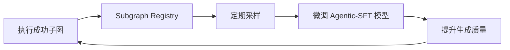

## 一、项目定位

**一个“原生理解 AgenticDSL 语义”的 LLM 推理系统**:
它可以是：
- 一个 **微调后的 LLM**（如 Llama-3 + AgenticDSL 指令微调）
- 一个 **推理引擎 + 模型的联合系统**（类似 SGLang，但深度集成 Agentic 语义）
- 一个 **支持 Agentic 原语的新型模型架构**（如内置 DAG 状态机）

### AgenticLLM 的设计路径（三种可行方案）

#### 方案 1：**微调 + 提示工程增强**（轻量级，快速落地）

- **做法**：
  - 在 Llama-3、Qwen 等开源模型上，用大量 **AgenticDSL 子图生成样本**进行 SFT（监督微调）
  - 训练目标：给定任务描述，输出合法 `### AgenticDSL '/path' ...` 块
- **优势**：
  - 可直接跑在 vLLM/llama.cpp 上
  - 提升 LLM 生成合法子图的概率
- **局限**：
  - 仍需 AgenticRT 做事后验证（无法 100% 保证正确）

> 🔧 适合：**过渡方案**，降低 `generate_subgraph` 的错误率。

#### 方案 2：**推理引擎深度定制**（目前草案路径）

- **做法**：
  - 接近SGLang设计LLM架构，**内置 AgenticDSL 图语法解析器**
  - 在 token 生成时，动态约束：
    - 节点类型必须是白名单（`tool_call`, `fork`, `assert`...）
    - 路径必须符合命名空间规则（`/lib/reasoning/**`）
    - `/lib/**` 子图必须包含 `signature` 块
  - 输出直接是 **解析后的子图对象**，而非原始文本
- **优势**：
  - 实现 **“生成即正确”**
  - 与 AgenticRT 无缝集成
- **技术栈**：
  - 前端：Agentic Grammar（类似 SGLang 的 CFG）
  - 后端：复用 FlashInfer / PagedAttention / RadixAttention

---

#### 方案 3：**原生 Agentic 架构模型**（本草案演进路径）

- **做法**：
  - 设计新型 LLM 架构，**内置状态机或图神经网络**，直接输出 DAG 节点
  - 例如：每个 token 对应一个“行为原语”，而非自然语言词
  - 训练数据：智能体任务日志 → DAG 执行轨迹
- **优势**：
  - 彻底摆脱自然语言生成的不确定性
  - 推理效率极高（无冗余文本）
- **挑战**：
  - 需要全新训练范式
  - 与现有生态不兼容

> 🔮 适合：**未来 3–5 年的 AI-Native 操作系统内核模型**。

## 二、核心理念

首要目标:  **智能体行为的正确、高效、可终止执行**
结构化输出: **AgenticDSL 三层节点契约驱动**
Agent:   **DAG 语义受控，生成即正确** 
缓存单位: Token 前缀（Radix）或 KV Block 到 **子图语义单元（Subgraph as Artifact）** 
调度单位: **DAG 节点 / 分支（Branch-aware）** 


## 三、AgenticLLM 核心模块设计

### **DAG Semantic Planner（DAG 语义规划器）**

- **输入**：来自 AgenticRT 的 `generate_subgraph` 请求，含：
  - 当前 DAG 路径（如 `/dynamic/plan_1`）
  - 上下文状态（`available_vars`, `permissions`）
  - 资源预算（`max_nodes=5`, `timeout=30s`）
- **输出**：**Execution Plan**，包含：
  - 目标子图路径（如 `/lib/reasoning/solve_equation`）
  - 允许的节点类型白名单
  - 预估 token 消耗与 KV Cache 需求
  - 是否可缓存（基于语义哈希）
- **创新**：
  - **路径策略引擎**：根据 `/lib/**` vs `/dynamic/**` 应用不同生成策略
  - **预算感知调度**：若预算不足，自动降级为简单子图或拒绝生成
- **生成 AgenticDSL 语法合法子图** 
- 将 AgenticDSL 的三层规范（节点类型、路径规则、签名契约）**编译为高效 grammar IR**
- 支持动态注入上下文约束（如 `available_tools`, `required_outputs`）
- 输出：**Token-level logits mask** 或 **SGLang-compatible CFG**

#### Agent 规划
- 输入：“为用户提供一份旅游攻略”
- 输出 DAG：
  ```
  [Plan Goal: 生成旅游攻略]
       ↓
  Task 1: 查询用户偏好 → Output Schema: { "interests": [...] }
       ↓
  Task 2: 搜索景点 → Output Schema: { "attractions": [...] }
       ↓
  Task 3: 生成行程 → Output Schema: { "itinerary": [...] }
  ```
- 每个任务可独立调度，结果可缓存复用。


### **Graph Grammar Compiler（图语法编译器）**

- **输入**：Execution Plan + AgenticDSL Schema
- **输出**：**Token-level Logits Mask** 或 **Incremental CFG**
- **核心能力**：
  - 支持 **嵌套子图约束**（如 `fork` 节点内必须生成合法子 DAG）
  - 动态注入上下文（如 `tool_call` 仅允许 `context.permissions` 中的工具）
  - 强制字段验证（`/lib/**` 必须含 `signature.inputs/outputs`）
- **性能优化**：
  - 预编译标准库 grammar（如 `/lib/reasoning/assert`）为 **GPU 可执行 mask**
  - 使用 **增量语法解析**，避免重复构建 AST

> ✅ **对比 SGLang**：从“通用 JSON/CFG”升级为“**Agentic 行为图语法**”。

### **子图级缓存（非 token 级）** 
- **Key** = `(node_path, context_hash, signature_hash, engine_version)`
- **Value** = `(Subgraph AST, KV Cache Handle, TTL)`
- **机制**：
  - 复用 vLLM 的 **PagedAttention Block Manager** 存储 KV Cache
  - 在生成结束时，自动注册子图到缓存
  - 下次相同语义请求，**跳过 LLM 推理，直接返回 AST + 复用 KV Cache**
- 支持：
  - **精确匹配**：完全相同语义 → 直接返回 AST + 复用 KV
  - **模糊匹配**：相同结构，变量不同 → 自动绑定新变量，复用 KV 前缀
- **后端**：可选 Redis（分布式）、LMDB（单机）、vLLM Block Manager（内存内）
- **淘汰策略**：LRU + 使用频率 + 语义热度（如 `/lib/reasoning/assert` 高优先级保留）

- **引入 Subgraph Semantic Cache**
```cpp
struct SubgraphCacheKey {
    std::string path;           // e.g. "/lib/reasoning/assert"
    uint64_t context_hash;      // 输入变量哈希
    uint64_t signature_hash;   // 节点签名哈希
    std::string engine_ver;    // 用于版本兼容
};

struct SubgraphCacheValue {
    AgenticDSL_AST ast;        // 子图结构
    PageTableRef kv_cache_ref; // 可复用的 KV Cache
    time_t ttl;
    int hit_count;
};
```

### **token缓存** 

#### Radix Tree（CPU 端）
- **节点结构**：
  ```cpp
  struct RadixNode {
    std::map<uint32_t, RadixNode*> children;
    KVSegment* segment;  // 指向 KV 缓存段
    int ref_count;
    time_t last_access;
  };
  ```
- **键**：`(modality_type, token_id)`，支持多模态前缀匹配。
- **驱逐策略**：LRU + TTL（默认 24h），最大缓存 100 万段。

#### Page Table（GPU 端）
- 兼容 vLLM 的 PagedAttention 格式：
  ```cpp
  struct PageTable {
    int block_size = 256;
    std::vector<PhysicalPage> pages;
    std::map<int, std::vector<int>> logical_to_physical;  // task_id → page_ids
  };
  ```
- 支持跨请求共享页，引用计数归零时释放。

#### Copy-on-Write（COW）
- 当共享页被修改时，自动复制到私有页。
- 原页引用计数减 1，新页创建并写入。


### 3. **DAG-Aware Batch Scheduler（DAG 感知批处理调度器）**
- 识别来自 AgenticRT 的 **并行请求**（如 `fork.branches`）
  - 在请求队列中打标 `dag_id` 和 `branch_id`
  - Scheduler 优先合并 **同一 dag_id 的分支请求**
  - 共享 prompt 前缀（如 “You are a reasoning agent...”）
- 自动合并为 batch，提交给 L2 适配器
- 支持 **异构批处理**：
  - 同一 batch 中，高性能，低延迟走不通的路径
- **反馈机制**：根据 batch 执行时间动态调整 future batch size


### 4. **Resource-Aware Generation Controller（资源感知生成控制器）**
- 接收 AgenticRT 下发的 **执行预算**：
  ```yaml
  budget:
    max_nodes: 10
    max_tokens: 2048
    allowed_tools: [search, math]
    timeout_sec: 30
  ```
- 在生成过程中实时监控：
  - 节点数量 → 动态终止
  - token 消耗 → 触发 early stop
  - 工具调用 → 过滤非法工具
- **安全兜底**：即使 LLM 试图生成非法节点，grammar 也会拦截

### 三层深度融合

| 层 | 融合来源 | 核心能力 | 创新点 |
|----|--------|--------|-------|
| **DAG Semantic Planner** | AgenticDSL + AgenticRT | 理解节点类型、路径策略、资源预算、并行结构 | 将 DAG 语义编译为 **执行计划（Execution Plan）** |
| **Structured Token Engine** | SGLang Grammar + DAG 语义 | 动态生成图语法、节点级约束、签名验证 | **Graph Grammar Compiler**，支持嵌套子图约束 |
| **High-Perf Inference Core** | vLLM Kernel + RadixAttention | PagedAttention + Subgraph Cache + DAG-aware Batching | **Subgraph KV Cache** 与 **Branch-Aware Continuous Batching** |

> 🔑 **关键突破**：三层之间**无边界调用**，例如：
> - Planner 在生成前预分配 KV Cache 块
> - Token Engine 实时反馈节点计数给 Planner 以控制预算
> - Inference Core 将子图执行结果直接写入 DAG Context


---

## 四、面向未来的演进能力设计

### 1. **版本化子图管理**
- 每个 `/lib/**` 子图支持 **语义版本**（如 `/lib/reasoning/v1/assert`）
- AgenticLLM 缓存按版本隔离
- 支持 **A/B 测试**：同一路径，不同版本并行生成

**建立 Subgraph Registry（子图注册中心）**
- 将成功执行的 `/lib/**` 子图自动归档
- 支持：
  - **版本管理**（v1.0, v1.1）
  - **权限控制**（公开、私有、企业级）
  - **A/B 测试**（同一路径，不同版本并行）


### 2. **自进化子图学习**
- 将 AgenticRT 执行成功的子图 **自动归档到 `/lib/solved/**`
- 定期用这些子图 **微调 Agentic-SFT 模型**
- 形成 **“执行 → 学习 → 生成” 闭环**

**构建自进化闭环**

> ✅ **效果**：系统越用越聪明，形成 **“执行 → 学习 → 生成” 闭环**


### 3. **跨设备协同推理**
- **边缘设备**（llama.cpp）：生成简单子图（如 `/lib/human/clarify`）
- **云端**（vLLM）：生成复杂推理子图
- AgenticLLM Service 作为 **协调器**，自动路由请求

### 4. **可验证生成（Verifiable Generation）**
- 未来集成 **形式化验证器**（如 Z3）：
  - 对生成的 `assert` 节点，自动验证逻辑一致性
  - 对 `math` 工具调用，验证表达式合法性
- 实现 **“生成 + 验证” 一体化**


## 五、架构设计

┌─────────────────────────────────────────────────────┐
│                  AgenticLLM 运行时                  │
│  ┌─────────────────────────────────────────────────┐  │
│  │                模型管理与加载                   │  │
│  │  • 模型缓存、版本控制、按需加载                 │  │
│  │  • 支持 GGUF、Safetensors                      │  │
│  └─────────────────────────────────────────────────┘  │
│  ┌─────────────────────────────────────────────────┐  │
│  │                 推理调度中枢                    │  │
│  │  • 流式推理、KV Cache 复用、动态批处理          │  │
│  │  • 支持 DAG 节点级推理调度                     │  │
│  │  • 设备画像：上报 CPU/GPU/内存/电量             │  │
│  └─────────────────────────────────────────────────┘  │
│  ┌─────────────────────────────────────────────────┐  │
│  │                  核心执行引擎                   │  │
│  │  • 吸收 llama.cpp：GGUF 量化、CPU/GPU 混合调度   │  │
│  │  • 吸收 SGLang：RadixAttention（前缀共享）       │  │
│  │  • 演进 vLLM：PagedAttention → 两级页表         │  │
│  │     ─ L0: CPU Radix 树（全局前缀页）             │  │
│  │     ─ L1: GPU Paged KV Cache（单请求 token 页）  │  │
│  └─────────────────────────────────────────────────┘  │
│  ┌─────────────────────────────────────────────────┐  │
│  │                 推理上下文管理                  │  │
│  │  • 为每个 DAG 节点维护独立上下文                │  │
│  │  • 支持中断恢复、跨设备迁移                     │  │
│  └─────────────────────────────────────────────────┘  │
│  ┌─────────────────────────────────────────────────┐  │
│  │                   监控与日志                    │  │
│  │  • 推理耗时、内存占用、GPU 使用率               │  │
│  │  • 支持 Prometheus / OpenTelemetry 集成         │  │
│  └─────────────────────────────────────────────────┘  │
└───────────────────────────┬─────────────────────────────┘
                            │
                            ▼
┌─────────────────────────────────────────────────────┐
│                    底层运行环境                       │
│  • CPU / GPU / 内存 / 存储 / WebAssembly / WebGPU   │
└─────────────────────────────────────────────────────┘

---

## 、总体架构图（文字版）

```
┌─────────────────────────────────────────────────────────┐
│                      多模态输入                         │
│  • 文本 / 图像 / 音频 / 视频                            │
│  • 自动转为统一 Token 流                                │
└───────────────────────┬─────────────────────────────────┘
                        │
                        ▼
┌─────────────────────────────────────────────────────────┐
│                  Agentic 语义调度器                     │
│  • 输入：用户目标（自然语言或 DSL）                     │
│  • 输出：AgenticDSL 计划（经编译器校验）                │
│  • 内置：AgenticDSL 编译器（语法/语义校验）             │
│  • 节点 Schema 强制绑定（tool_call, assert, fork...）   │
└───────────────────────┬─────────────────────────────────┘
                        │
                        ▼
┌─────────────────────────────────────────────────────────┐
│                  子图语义缓存引擎                         │
│  • 缓存单位：Subgraph（路径 + 上下文哈希）               │
│  • 支持：精确匹配、模糊匹配（变量重绑定）、热度淘汰     │
│  • 输出：AST + 可复用 KV Cache 引用                     │
└───────────────────────┬─────────────────────────────────┘
                        │ 未命中 / 需执行
                        ▼
┌─────────────────────────────────────────────────────────┐
│                    核心中枢                             │
│  ┌───────────────────────────────────────────────────┐  │
│  │              Agentic 原生执行内核                 │  │
│  │  • Graph Grammar Compiler（DSL → Token Mask）    │  │
│  │  • Branch-Aware Continuous Batching               │  │
│  │  • 资源预算控制（Token, KV, Time）                │  │
│  └───────────────────────────────────────────────────┘  │
│  ┌───────────────────────────────────────────────────┐  │
│  │                模型执行器                       │  │
│  │  • Backend Plugin: vLLM / SGLang / llama.cpp       │  │
│  │  • 多模态主干：Nexus-Gen / Qwen-VL                │  │
│  └───────────────────────────────────────────────────┘  │
│  ┌───────────────────────────────────────────────────┐  │
│  │                资源调度器                       │  │
│  │  • 基于 DAG 预估进行预分配                       │  │
│  │  • 支持 GPU Spilling 与弹性扩缩                   │  │
│  └───────────────────────────────────────────────────┘  │
└───────────────────────┬─────────────────────────────────┘
                        │
                        ▼
┌─────────────────────────────────────────────────────────┐
│                    存储层                               │
│  • 模型仓库：HuggingFace / S3                          │
│  • 子图注册中心（Subgraph Registry）：版本、权限、A/B  │
│  • 监控日志：Prometheus + OpenTelemetry               │
│  • 自进化数据集：成功子图归档                         │
└─────────────────────────────────────────────────────────┘
```

---


## 三、构建伟大下一代产品所需的完整文档列表

| 文档类型 | 文档名称 | 说明 |
|----------|----------|------|
| **核心架构** | 1. AgenticLLM 架构设计文档（v2.0） | 本文档 |
| | 2. AgenticDSL 语言规范 | 定义节点类型、语法、语义、白名单、版本策略 |
| | 3. Subgraph 语义缓存协议 | 定义缓存键、值、匹配算法、淘汰策略 |
| | 4. Graph Grammar 编译器规范 | 定义 DSL 节点到 logits mask 的编译规则 |
| **模块实现** | 5. Agentic 语义调度器 API 文档 | REST/gRPC 接口定义 |
| | 6. 子图注册中心 API 文档 | CRUD、A/B 测试、版本管理接口 |
| | 7. 模型执行器插件开发指南 | 如何开发 vLLM/llama.cpp 插件 |
| | 8. 资源调度器算法白皮书 | 预估、分配、Spilling 算法细节 |
