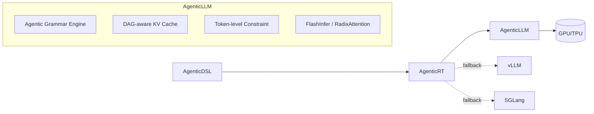

## 一、核心问题澄清：AgenticLLM 是什么？

**一个“原生理解 AgenticDSL 语义”的 LLM 推理系统**:

它可以是：
- 一个 **微调后的 LLM**（如 Llama-3 + AgenticDSL 指令微调）
- 一个 **推理引擎 + 模型的联合系统**（类似 SGLang，但深度集成 Agentic 语义）
- 一个 **支持 Agentic 原语的新型模型架构**（如内置 DAG 状态机）

---

## 二、为什么需要 AgenticLLM？——现有引擎的局限

| 引擎 | 在 AgenticDSL 场景下的不足 |
|------|--------------------------|
| **vLLM** | 只做高速 token 生成，**不理解** `type: fork`、`signature`、`permissions` 等语义 |
| **SGLang** | 能约束结构，但约束的是 **通用语法**（JSON/CFG），**非 Agentic 行为语义** |
| **llama.cpp** | 轻量但无结构化生成、无并行调度、无契约验证 |

> ✅ **痛点**：当前 LLM 引擎都是“通用文本生成器”，而 AgenticDSL 需要的是“**智能体行为执行器**”。

---

## 三、AgenticLLM 的设计路径（三种可行方案）

### 方案 1：**微调 + 提示工程增强**（轻量级，快速落地）

- **做法**：
  - 在 Llama-3、Qwen 等开源模型上，用大量 **AgenticDSL 子图生成样本**进行 SFT（监督微调）
  - 训练目标：给定任务描述，输出合法 `### AgenticDSL '/path' ...` 块
- **优势**：
  - 可直接跑在 vLLM/llama.cpp 上
  - 提升 LLM 生成合法子图的概率
- **局限**：
  - 仍需 AgenticRT 做事后验证（无法 100% 保证正确）

> 🔧 适合：**过渡方案**，降低 `generate_subgraph` 的错误率。

---

### 方案 2：**推理引擎深度定制**（中量级，推荐路径）

- **做法**：
  - 基于 SGLang 或 vLLM 内核，**内置 AgenticDSL 图语法解析器**
  - 在 token 生成时，动态约束：
    - 节点类型必须是白名单（`tool_call`, `fork`, `assert`...）
    - 路径必须符合命名空间规则（`/lib/reasoning/**`）
    - `/lib/**` 子图必须包含 `signature` 块
  - 输出直接是 **解析后的子图对象**，而非原始文本
- **优势**：
  - 实现 **“生成即正确”**
  - 与 AgenticRT 无缝集成
- **技术栈**：
  - 前端：Agentic Grammar（类似 SGLang 的 CFG）
  - 后端：复用 FlashInfer / PagedAttention / RadixAttention

> 🌟 这就是 **“SGLang for AgenticDSL”** —— 你设想的 **AgenticLLM 的核心形态**。

---

### 方案 3：**原生 Agentic 架构模型**（重量级，长期愿景）

- **做法**：
  - 设计新型 LLM 架构，**内置状态机或图神经网络**，直接输出 DAG 节点
  - 例如：每个 token 对应一个“行为原语”，而非自然语言词
  - 训练数据：智能体任务日志 → DAG 执行轨迹
- **优势**：
  - 彻底摆脱自然语言生成的不确定性
  - 推理效率极高（无冗余文本）
- **挑战**：
  - 需要全新训练范式
  - 与现有生态不兼容

> 🔮 适合：**未来 3–5 年的 AI-Native 操作系统内核模型**。

---

## 四、AgenticLLM 能否替代 SGLang/vLLM/llama.cpp？

| 维度 | 能否替代？ | 说明 |
|------|----------|------|
| **功能覆盖** | ✅ **可以** | AgenticLLM（方案2） = SGLang（结构化） + vLLM（高性能） + Agentic 语义 |
| **性能** | ⚠️ **初期略低，长期可超越** | 因增加语义解析开销，但可通过编译优化、缓存弥补 |
| **通用性** | ❌ **不应完全替代** | AgenticLLM 专为智能体优化，**不适合纯聊天或自由写作** |
| **生态兼容** | ✅ **可共存** | AgenticLLM 可作为 AgenticRT 的**默认后端**，其他任务仍用 vLLM |

> ✅ **正确姿势**：  
> **AgenticLLM 是“专用引擎”，vLLM/SGLang 是“通用引擎”** —— 按场景选择，而非取代。

---

## 五、理想架构：全栈 Agentic 智能体系统

- **主路径**：AgenticDSL → AgenticRT → AgenticLLM（高性能、高可靠）
- **备选路径**：复杂任务失败时，降级调用通用引擎

---

## 六、总结与建议

1. AgenticRT + SGLang 扩展（方案2）
2. 同时收集数据，微调 **Agentic-SFT 模型**（方案1）
3. 长期探索 **原生 Agentic 架构**（方案3） |

